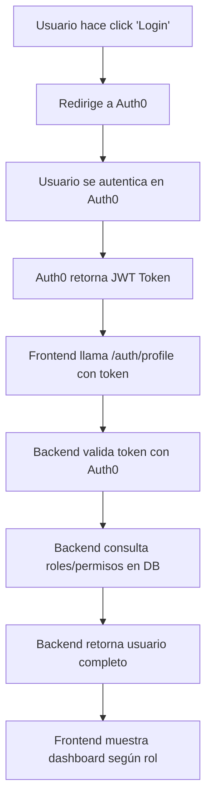

# 🔗 Sistema Híbrido Auth0 + Base de Datos - Configuración Completa

## ✅ Estado Actual: SISTEMA OFICIAL CONFIGURADO

Se ha eliminado el sistema de demostración y ahora el frontend está configurado para usar **Auth0 real + Base de datos** para el control de acceso completo.

## 🔧 Configuración Necesaria

### 1. **Auth0 Setup**

#### Crear Aplicación en Auth0:
1. Ve a [Auth0 Dashboard](https://manage.auth0.com/)
2. Crear nueva aplicación → **Single Page Application**
3. Configurar URLs:
   - **Allowed Callback URLs**: `http://localhost:3000`
   - **Allowed Logout URLs**: `http://localhost:3000`
   - **Allowed Web Origins**: `http://localhost:3000`

#### Configurar API en Auth0:
1. Crear API con identificador: `https://api.agromano.com`
2. Habilitar **RBAC** en Settings
3. Agregar **Scopes/Permisos** desde: `backend/docs/AUTH0_PERMISOS_SETUP.md`

### 2. **Variables de Entorno**

Actualizar `frontend/.env` con tus credenciales reales:

```env
# Reemplazar con tus credenciales de Auth0
REACT_APP_AUTH0_DOMAIN=tu-dominio.auth0.com
REACT_APP_AUTH0_CLIENT_ID=tu-client-id-real
REACT_APP_AUTH0_AUDIENCE=https://api.agromano.com

# Backend API
REACT_APP_API_URL=http://localhost:3001/api
REACT_APP_ENVIRONMENT=production
```

### 3. **Backend Database**

Asegúrate de que el backend esté ejecutándose con:
- ✅ Base de datos PostgreSQL configurada
- ✅ Tablas de usuarios, roles y permisos creadas
- ✅ Auth0 JWT validation configurado
- ✅ API endpoint `/auth/profile` funcionando

## 🚀 Cómo Funciona el Sistema Híbrido

### **Flujo de Autenticación:**



### **Responsabilidades:**

- **Auth0**: 🔐 Autenticación, tokens JWT, logout
- **Base de Datos**: 👥 Roles, permisos, datos de usuario específicos
- **Backend**: 🔄 Combina Auth0 + DB, valida permisos
- **Frontend**: 🎨 UI adaptada según roles y permisos

## 🎯 Para Probar el Sistema

### **1. Configurar Auth0 (Una vez)**
```bash
# 1. Crear aplicación en Auth0 Dashboard
# 2. Obtener Domain y Client ID
# 3. Actualizar .env con credenciales reales
```

### **2. Iniciar Backend**
```bash
cd backend
npm install
npm run dev  # Puerto 3001
```

### **3. Crear Usuario Administrador en DB**
```sql
-- Ejecutar en PostgreSQL
INSERT INTO usuarios (email, nombre, auth0_id, activo) 
VALUES ('admin@tuempresa.com', 'Administrador', 'auth0|...', true);

INSERT INTO usuario_roles (usuario_id, rol_id) 
VALUES (1, 1); -- Rol de Administrador
```

### **4. Iniciar Frontend**
```bash
cd frontend
npm start  # Puerto 3000
```

### **5. Hacer Login**
1. Ir a http://localhost:3000
2. Click "Iniciar Sesión con Auth0"
3. Autenticarse con usuario administrador
4. ✨ **Ver el dashboard de administrador**

## 📊 Dashboard de Administrador

Una vez autenticado correctamente, verás:

- ✅ **Sidebar azul** con navegación
- ✅ **Header personalizado** con nombre del usuario
- ✅ **Estadísticas del sistema** en cards
- ✅ **Actividad reciente** de la plataforma
- ✅ **Acciones rápidas** para gestión
- ✅ **Indicadores de permisos** basados en la DB
- ✅ **Botones de cambio de vista** (si tienes múltiples roles)

## 🛡️ Seguridad Implementada

### **Autenticación**
- ✅ OAuth 2.0 / OpenID Connect
- ✅ JWT tokens seguros
- ✅ Refresh token automático
- ✅ Logout seguro

### **Autorización**
- ✅ RBAC desde base de datos
- ✅ Permisos granulares por módulo
- ✅ Validación en frontend y backend
- ✅ Protección de rutas

### **Datos**
- ✅ Tokens encriptados
- ✅ Comunicación HTTPS (en producción)
- ✅ Validación de permisos en cada request
- ✅ Logs de auditoría

## 🔧 Próximos Pasos

### **Para Producción:**
1. **SSL/HTTPS**: Configurar certificados
2. **Domain**: Actualizar URLs de Auth0
3. **Environment**: Variables de producción
4. **Monitoring**: Logs y métricas

### **Para Desarrollo:**
1. **Más Roles**: Agregar usuarios con diferentes roles en DB
2. **Permisos**: Refinar permisos específicos por módulo
3. **UI**: Personalizar dashboard según necesidades
4. **Integración**: Conectar módulos del equipo

---

## 🎉 ¡Sistema Híbrido Listo!

El sistema ahora está configurado para **producción real** con:
- 🔐 **Auth0 oficial** para autenticación
- 🗄️ **Base de datos** para roles y permisos
- 🎨 **Dashboard moderno** que se adapta al rol del usuario
- 🛡️ **Seguridad completa** con RBAC

Solo necesitas configurar tus credenciales de Auth0 y crear usuarios en la base de datos.
